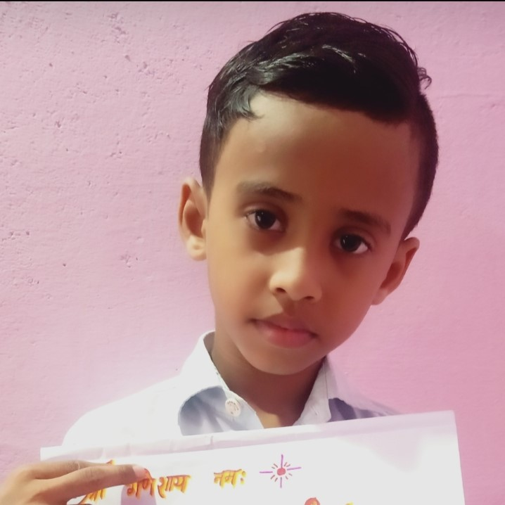
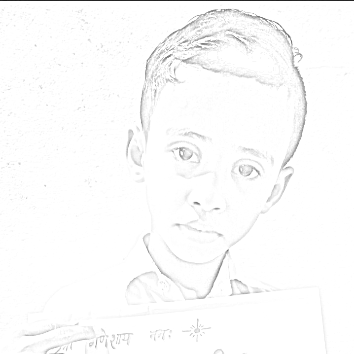

# Image to Sketch Converter

This simple Python script converts a regular image into a sketch using the OpenCV library. The resulting sketch has a pencil-drawing effect, providing a unique and artistic transformation to your images.


## How to Use

### Raw image            

### Sketch image             

## How to Use

1. Make sure you have Python installed on your system.
2. Install the required library using:

    ```bash
    pip install opencv-python
    ```

3. Download or clone this repository to your local machine.

4. Replace "[your image].jpg" with the path to your input image file.

5. Adjust the parameters if needed, such as the file names and the blur settings.

6. Run the script:

    ```bash
    python image_to_sketch.py
    ```

7. Find your newly created sketch in the same directory with the specified file name.

## Code Snippet

```python
import cv2

image = cv2.imread("[your image].jpg")

gray = cv2.cvtColor(image, cv2.COLOR_BGR2GRAY)

invert = cv2.bitwise_not(gray)

blur = cv2.GaussianBlur(invert, (21,21), 0)

inverted_blur = cv2.bitwise_not(blur)

sketch = cv2.divide(gray, inverted_blur, scale=256.0)

cv2.imwrite('[Your new sketch image file name].png', sketch)
```

Feel free to experiment with the parameters to achieve different sketch effects. Enjoy converting your images into captivating sketches! 🎨✨
